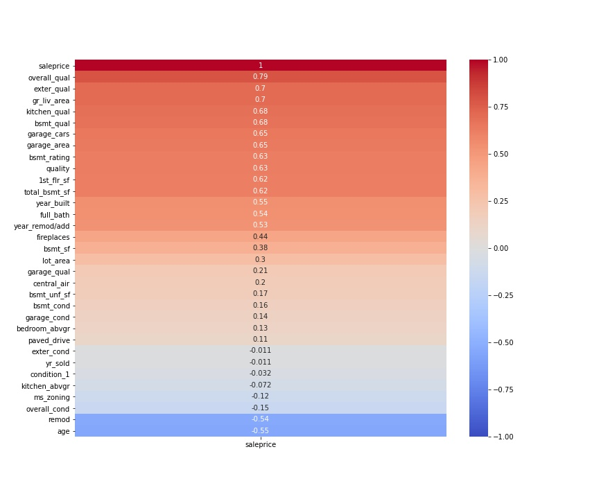
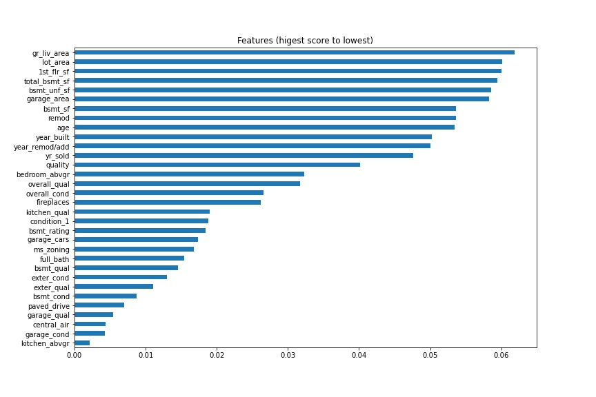
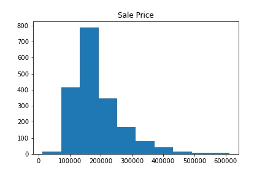
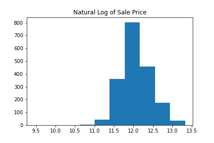
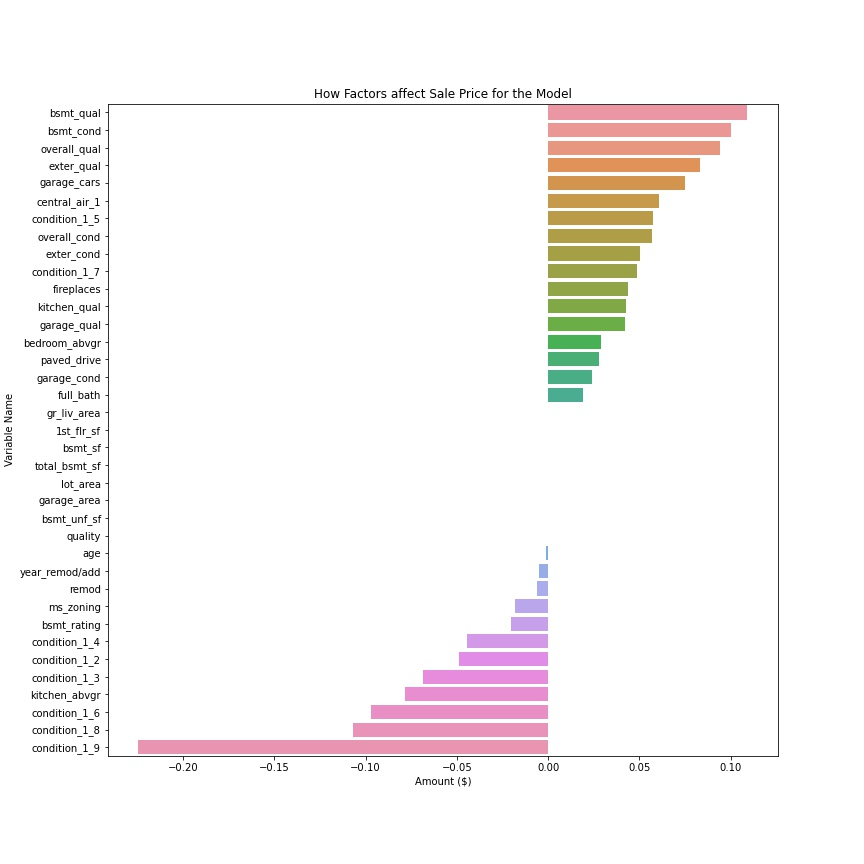

# Project 2

### Contents:
- [Problem Statement](#Problem-Statement)
- [Data Dictionary](#Data-Dictionary)
- [Brief Summary of Analysis](#Brief-Summary-of-Analysis)
- [Conclusions and Recommendations](#Conclusions-and-Recommendations)

## Problem Statement

The Ames housing dataset contains detailed information about homes that were sold between 2006 and 2010, along with their sale price.  Our real estate agents  want to be able to advise  their selling clients on the best sale price for their home. This project aims to analyze the Ames housing dataset and create a model that predicts the sale price of a home.

## Why is this important?

As was shown by the 2008 financial crisis, it is essential for the economy that the amount of a bank’s real estate lending matches the actual value of the real estate. Getting a good estimate of the price of a house is hard even for the most seasoned real estate agents.

## Data Dictionary

|Feature|Type|Dataset|Description|
|---|---|---|---|
ms_zoning|object|Identifies the general zoning classification of the sale
lot_area|float|Lot size in square feet
condition_1|object|Proximity to various conditions
overall_qual|int|Rates the overall material and finish of the house
overall_cond|int|ates the overall condition of the house
gr_liv_area|int|Above grade (ground) living area square feet
garage_area|float|Size of garage in square feet
garage_cars|float|Size of garage in car capacity
total_bsmt_sf|float|Total square feet of basement area
1st_flr_sf|int|First Floor square feet
year_built|int|Original construction date
year_remod/add|int|Remodel date (same as construction date if no remodeling or additions)
full_bath|int|Full bathrooms above grade
garage_yr_blt|float|Year garage was built
exter_qual|object|Evaluates the quality of the material on the exterior 
exter_cond|object|Evaluates the present condition of the material on the exterior
bsmt_qual|object|Evaluates the height of the basement
bsmt_cond|object|Evaluates the general condition of the basement
bsmt_unf_sf|float|Unfinished square feet of basement area
central_air|object|Central air conditioning
bedroom_abvgr|int|Bedrooms above grade (does NOT include basement bedrooms)
kitchen_abvgr|int|Kitchens above grade
kitchen_qual|object|Kitchen quality
fireplaces|int|Number of fireplaces
paved_drive|object|Paved driveway
age|int|Age of a home (subtract year built from year sold)
quality|int|Quality of a home (multiply the overall and exterior quality and condition features)
remod|int|Years since remodeled (subtract year remodeled from year sold)
bsmt_rating|int|Basement rating (multiply basement quality and condition features)
bsmt_sf|float|Finished basebemnt square footage (subtract unfinished basement square footage from total basement square footage)

## Brief Summary of Analysis

We looked at real estate data for homes sold in Ames, IA between 2006 and 2010. We cleaned the data, then performed exploratory data analysis to identify the best features we could use to design a model that predicts the sale price of a home. With these features, we looked at several model options which we then ran accross our testing data. Each model was scored using the same metrics, and the model with the best scores was chosen as the production model. We finished with conclusions and recommendations for the given problem.

There are two important phases we need to consider when tuning our model:  
Feature selection  
Normalizing our target  

Feature selection is a technique where we choose those features in our data that contribute most to the target variable. In other words we choose the best predictors for the target variable. Here, we used a heat map to rank the features by how correlated they are with the sale price. 

Feature importance is an inbuilt class that comes with Tree Based Classifiers. We used Extra Tree Classifier for extracting the top features for the dataset.

Logarithmic transformation is a convenient means of transforming a highly skewed variable into a more normalized dataset. Here, we did just that for our target variable, sale price, which improved our model.  

## Conclusions and Recommendations

**Conclusions:**  

The coefficients and the intercept define our model. Below we have a graph showing how each feature impacts our target, the sale price, when we are making a prediction.

Below is a list of our coefficients:

|Feature|Coefficient|
|---|---|
bsmt_qual|0.142359
bsmt_cond|0.133489
overall_qual|0.103121
condition_1_7|0.096247
exter_qual|0.085971
garage_cars|0.085248
central_air_1|0.071070
garage_qual|0.068004
overall_cond|0.061425
exter_cond|0.055228
kitchen_qual|0.051063
fireplaces|0.041384
condition_1_5|0.035164
full_bath|0.022798
bedroom_abvgr|0.022689
paved_drive|0.021415
garage_cond|0.020858
gr_liv_area|0.000149
1st_flr_sf|0.000059
bsmt_sf|0.000042
total_bsmt_sf|0.000022
lot_area|0.000003
bsmt_unf_sf|-0.000020
garage_area|-0.000035
quality|-0.000426
age|-0.001200
year_remod/add|-0.007287
remod|-0.007682
ms_zoning|-0.014479
bsmt_rating|-0.031356
condition_1_2|-0.050458
condition_1_3|-0.057442
condition_1_4|-0.066468
condition_1_6|-0.071196
kitchen_abvgr|-0.075693
condition_1_8|-0.085373
condition_1_9|-0.106165

*What this means: for every 1 unit (standard deviation) increase in a variable, holding all other features constant, we can expect a percentage increase/decrease in a home's price, on average.*

We recommend our realtors use this model to predict the sale price of a home when working with their selling clients.

For 1 point increase in the quality of the kitchen, holding all other features constant, we can expect, on average, a 5% increase in the price of a home.

If the home has a fireplace, the increase in the price is estimated at about 4%.

For 1 year increase in the age of a home, we can expect a decrease of about 0.12% in the price.  

**Next steps:**

Further evaluate and tune the model for a more accurate prediction. Consider adding/engineering more features. Additional research is needed into specific neighborhoods and other factors that influenced home prices, such as the market crash in 2008.

**Resources:**

[Factors that influence home value](https://www.opendoor.com/w/blog/factors-that-influence-home-value)  
[Predicting real estate prices](https://peltarion.com/knowledge-center/documentation/tutorials/predict-real-estate-prices)  
[Feature selection](https://www.kaggle.com/jepsds/feature-selection-using-selectkbest?utm_campaign=News&utm_medium=Community&utm_source=DataCamp.com)

**Data Source:**  

[Ames Housing Dataset](https://www.kaggle.com/prevek18/ames-housing-dataset)